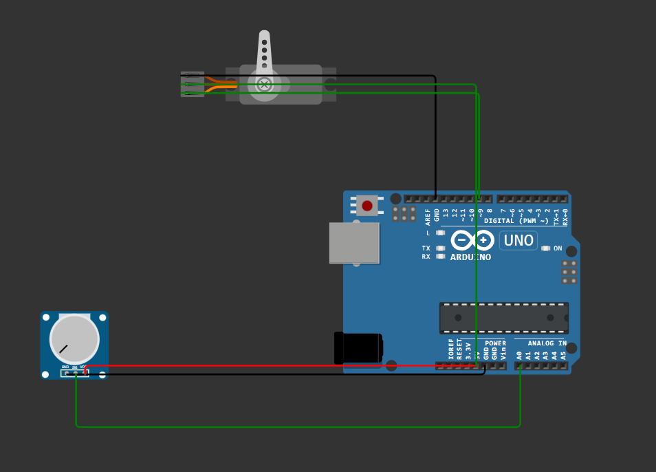
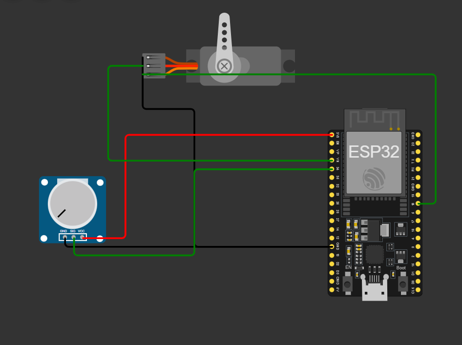

# Workshop: Do Zero à IoT com Arduino e ESP32

Este repositório contém os projetos práticos desenvolvidos durante o workshop, cobrindo desde a prototipagem básica com Arduino Uno até a conectividade IoT com ESP32.

Os projetos estão configurados para serem compilados com **PlatformIO** (dentro do VS Code) e simulados na plataforma **Wokwi**, permitindo um desenvolvimento rápido e sem a necessidade de hardware físico.

## Estrutura do Repositório

Este repositório contém dois projetos PlatformIO independentes:

* **`workshop-arduino-uno/`**: Prática 1. Um projeto PlatformIO completo para o Arduino Uno, focado em I/O (leitura de sensor e controle de atuador).

* **`workshop-esp/`**: Prática 2. Um projeto PlatformIO completo para o ESP32, focado em migração de código, conectividade Wi-Fi e processamento paralelo (Dual-Core).

## Pré-requisitos de Software

Para executar estes projetos em sua máquina, você precisará de:

1.  **Visual Studio Code (VS Code)**
2.  **Extensão PlatformIO IDE** (Instalada *dentro* do VS Code)
3.  **Extensão Wokwi for VS Code** (Instalada *dentro* do VS Code)

## Como Executar as Simulações

É muito importante: você deve abrir cada projeto como uma pasta separada no VS Code.

1.  Abra o VS Code.
2.  Vá em "Arquivo" > "Abrir Pasta..." (ou "File" > "Open Folder...").
3.  Selecione a pasta do **primeiro** projeto (ex: `workshop-arduino-uno`) e clique em "Abrir".
4.  Aguarde o PlatformIO carregar e instalar as ferramentas necessárias (observe a barra de status azul na parte inferior).
5.  **Compile (Build):** Antes de simular, você precisa compilar o projeto.
    * Pressione `Ctrl + Alt + B` (Windows/Linux) ou `Cmd + Alt + B` (Mac).
    * *Alternativa:* Clique no ícone de "Build" (✓) do PlatformIO na barra de status.
6.  **Inicie a Simulação:**
    * Pressione `F1` (ou `Ctrl + Shift + P`) para abrir a Paleta de Comandos.
    * Digite e selecione **`Wokwi: Start Simulator`**.
7.  A simulação do Wokwi será aberta, rodando o firmware que você acabou de compilar.
8.  Para rodar o segundo projeto, feche a janela do VS Code e repita o processo a partir do **passo 2**, abrindo a pasta `workshop-esp/`.

---

## Detalhes das Práticas

### Prática 1: `workshop-arduino-uno` (Controle de Servo)

* **Arquivo de Código:** `src/main.ino`
* **Objetivo:** Ler o valor de um potenciômetro para controlar o ângulo (posição) de um servo motor.
* **Conceitos:**
    * Uso de bibliotecas (`Servo.h`).
    * `analogRead()`: Leitura de sensor analógico (10-bit: 0-1023).
    * `map()`: Mapeamento de valores.
    * `meuServo.write()`: Controle de atuador.

### Prática 2: `workshop-esp` (Telemetria IoT com Dual-Core)

* **Arquivo de Código:** `src/main.ino`
* **Objetivo:** Adaptar o projeto do Arduino para o ESP32 e adicionar conectividade Wi-Fi. O servo motor é controlado em tempo real, enquanto um núcleo de processamento separado (Core 0) envia o ângulo para a nuvem.
* **Conceitos:**
    * **Migração:** Adaptação do código para os níveis de tensão do ESP32 (3.3V).
    * **ADC de 12-bit:** O `analogRead()` do ESP32 retorna valores de 0 a 4095.
    * **Wi-Fi:** Conexão à rede com `WiFi.h`.
    * **HTTP POST:** Envio de dados (Telemetria) para um servidor na nuvem (usando `HTTPClient.h`).
    * **Multitasking (Dual Core):**
        * O `loop()` (rodando no **Core 1**) é responsável apenas pelo servo, garantindo movimento **instantâneo e sem travas**.
        * Uma nova "Tarefa" (`taskRede`, rodando no **Core 0**) é criada para cuidar da rede (que é lenta e "bloqueante") em paralelo, sem nunca interferir no controle do motor.

## Solução de Problemas Comuns

* **Erro:** `Wokwi: Error loading web view: ... service worker ...`
    * **Solução:** A extensão do Wokwi no VS Code "engasgou". Pressione `F1` (ou `Ctrl+Shift+P`), digite `Developer: Reload Window` e pressione Enter. Isso reiniciará a interface do VS Code.

* **Erro:** `Error: File not found: .pio/build/uno/firmware.hex` (ou `.bin` no ESP32)
    * **Solução:** Você não compilou (build) o projeto antes de iniciar o simulador. Siga o **Passo 5** ("Compile") das instruções de execução.

## Links Úteis e Próximos Passos

Aqui estão os links para todas as ferramentas e documentações que usamos (e recomendamos) durante o workshop.

### Ferramentas

* **[Arduino IDE](https://www.arduino.cc/en/software)**: A IDE oficial e o ponto de partida clássico para a programação Arduino. Mencionamos ela como a alternativa principal ao PlatformIO.
* **[Wokwi](https://wokwi.com/)**: O simulador online que usamos. Ótimo para testar ideias rapidamente sem precisar de hardware.
* **[VS Code](https://code.visualstudio.com/)**: O nosso editor de código.
* **[PlatformIO](https://platformio.org/)**: A ferramenta de desenvolvimento profissional para embarcados, usada como extensão no VS Code.

### Documentação e Ecossistemas

* **[Referência da Linguagem Arduino](https://www.arduino.cc/reference/pt/)**: A "Bíblia" para todas as funções padrão do Arduino (como `digitalWrite`, `analogRead`, `map`, etc.).
* **[Documentação Oficial do ESP32 (Espressif)](https://docs.espressif.com/projects/esp-idf/en/latest/esp32/)**: A documentação oficial do fabricante do chip. É densa, mas é a fonte primária de informação.
* **[Random Nerd Tutorials (RNT)](https://randomnerdtutorials.com/)**: **(Altamente Recomendado)** O melhor site para tutoriais práticos com ESP32, ESP8266 e Arduino. A maioria das suas dúvidas futuras provavelmente já foi respondida lá.

### Bibliotecas

* **[Documentação da `ESP32Servo`](https://madhephaestus.github.io/ESP32Servo/)**: Documentação da biblioteca de Servo que usamos na Prática 2, otimizada para o ESP32.
* **[Referência da `HTTPClient` (ESP32)](https://randomnerdtutorials.com/esp32-http-get-post-arduino/)**: Um excelente tutorial do RNT que explica em detalhes como usar `HTTPClient` para GET e POST.
